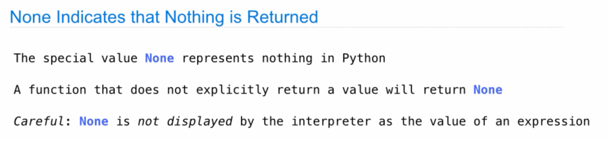
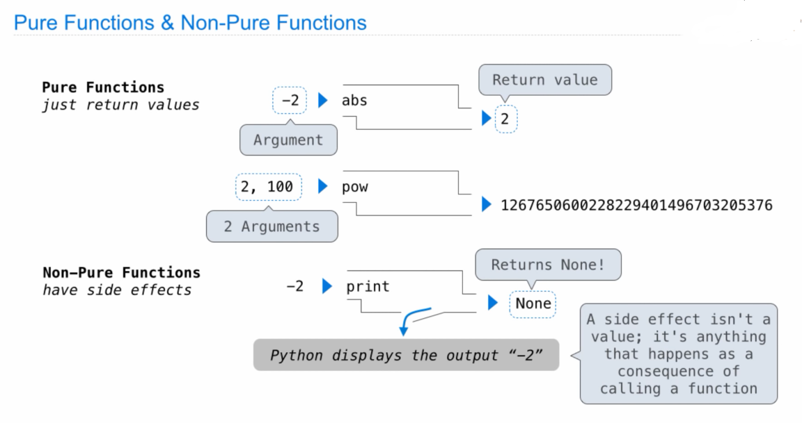
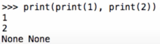
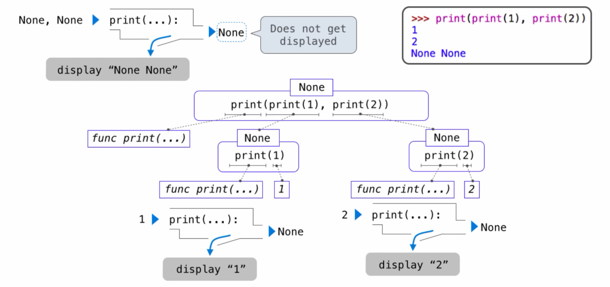

2021.12.21

这节开始看比较新的版本：Fall 2021

---

## **Print and None**

[link](https://www.youtube.com/watch?v=jNYc5Gdwo3c&list=PL6BsET-8jgYWpnJAjl-O8v-xfp5Vf3zkS&index=2)

函数分为：

* Pure Functions: 
  
    只通过计算返回一个值

* Non-Pure Functions： 
        
    不返回值但是可能会做一些别的事情，比如`print()`是一个函数，它不输出任何值，但是会打印出来参数，所以会发生如下的事情：

    

    Expression tree 如下：

    

---

### **Multiple Environments**

[Vedio link](https://www.youtube.com/watch?v=IPec2A7j2bY&list=PL6BsET-8jgYWpnJAjl-O8v-xfp5Vf3zkS&index=3)

讲实话这节的长难句有点多，逻辑比较复杂，没有特别搞明白讲了什么，，，

然后去看了课本，里面的介绍会比较详细而且不用担心长难句听不懂哈哈哈。[1.3.1   Environments](http://composingprograms.com/pages/13-defining-new-functions.html#environments)

这里放几个我认为比较重要的概念和python tutor作为演示。

1. **Intrinsic name & Bound name of a function**

    <iframe width="800" height="500" frameborder="0" src="https://pythontutor.com/iframe-embed.html#code=f%20%3D%20max%0Amax%20%3D%203%0Aresult%20%3D%20f%282,%203,%204%29%0Amax%281,%202%29%20%20%23%20Causes%20an%20error&codeDivHeight=400&codeDivWidth=350&cumulative=true&curInstr=0&origin=composingprograms.js&py=3&rawInputLstJSON=%5B%5D"> </iframe>

    >The name of a function is repeated twice, once in the frame and again as part of the function itself. The name appearing in the function is called the intrinsic name. The name in a frame is a bound name. There is a difference between the two: different names may refer to the same function, but that function itself has only one intrinsic name.

    函数有两种名字：Intrinsic name & Bound name。

    在Diagram中左侧的是bound name，右侧是intrinsic name，有点类似于指针变量和地址的关系（这块我已经基本上完全忘掉了），左侧的名字是你可以改变的，比如你叫你的手机叫宝贝，但是实际上只是宝贝这个名称指向了这个唯一的设备。本质名还是那个唯一的标识码。

2. 

---

### **Miscellaneous Python Features**

