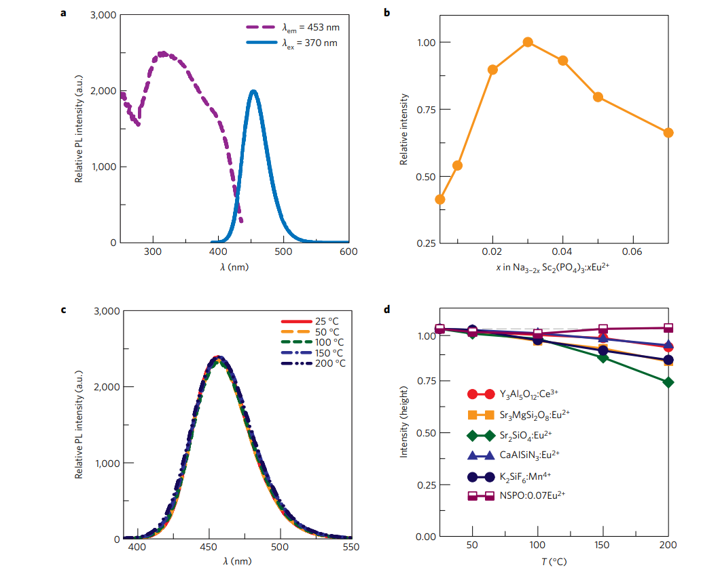
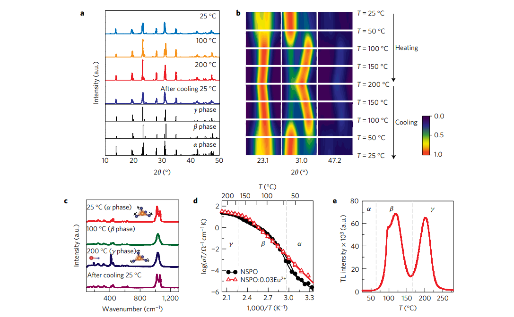
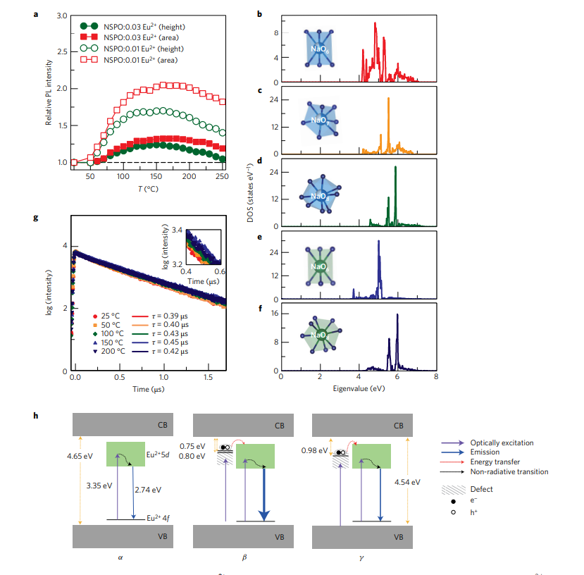
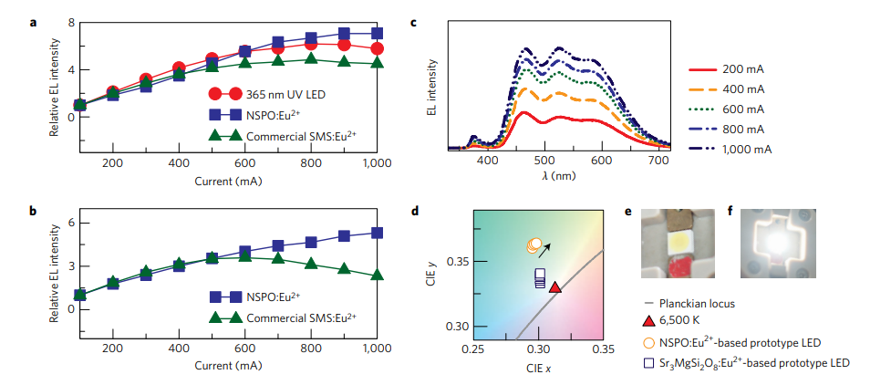

一种零热猝灭的荧光粉

---

Yoon Hwa Kim $^{1}$, Paulraj Arunkumar $^{1}$, Bo Young Kim $^{1}$, Sanjith Unithrattil $^{1}$, Eden $Kim ^{1}$, Su-Hyun Moon $^{1}$, Jae Young Hyun $^{1,2}$, Ki Hyun Kim $^{2 \dagger}$, Donghwa Lee $^{1}$, Jong-Sook Lee $^{1}$ and Won Bin Im $^{1 \star}$

---

## **摘要**

荧光转换白光LED (pc-WLEDs) 是效率较高的光源，用于照明、高级显示和电子设备中。关于pc-WLEDs的一大难题是热猝灭，在大功率LED运作时，会随着温度上升产生发射损失。本文中合成了一种蓝色发光 $Na _{3-2 x} Sc _{2}\left( PO _{4}\right)_{3}$ ： $x E u ^{2+}$ 荧光粉 $\left(\lambda_{ em }=453 nm \right)$ 在 $200^{\circ} C$ 该荧光粉在200℃时也不存在热猝灭现象。这种零热猝灭现象源于荧光粉具有补偿发射损失的能力，并且温度升高也可以维持发光。这些发现可以用多晶型俢饰,以及在温度升高时热激活缺陷能级的电子-空穴对到 $Eu ^{2+} 5 d$带可能的能量传递来解释。我们的成果开启了对高功率LED用零热猝灭荧光粉的研究。

---

荧光转换白光LED(pc-WLEDs) $^{1}$已经因其环保、坚固以及寿命长的特性走进了千家万户$^{2}$。然而，基于蓝色LED激发的$Y _{3} Al _{5} O _{12}: Ce ^{3+}$ 由于红光少而显色性差。具有三色荧光粉的近紫外LED因其高显色性以及优异的颜色均匀性而倍受科研关注。然而，开发具有高亮度和热稳定性的荧光粉是一个关键挑战$^{4-6}$.关于后者，LED工作时的产热$\left(\sim 200^{\circ} C \right)$会导致发射损失，通常归因于激活剂基态激发电子的非辐射弛豫。这种所谓的热猝灭（TQ）会严重影响PC-WLEDs的效率并改变白平衡。

TQ用组态坐标图解释，其中激发发光中心通过声子相互作用热激活，然后通过激发态与基态的交叉点释放$^{7-9}$。这种热激活的非辐射跃迁几率强烈依赖于温度。因此，TQ取决于基质的结构参数，即刚性键合网络表示的结构刚度和键合强度，这可以极大地减少随温度升高而产生的发射损失$^{10}$。一般来说，石榴石、氮化物$^{11,12}$和磷酸盐$^{4}$是热稳定的荧光基质，由于其密集的网络结构，具有优异的结构刚性。商业上可用的的低热猝灭荧光粉有$\text{YAG:Ce }^{3+},\text{(Sr,Ca)AlSiN} _{3}:\text{Eu}^{2+}$和$\text{SrSi}_{2} \text{O}_{2}\text{N} _{2}:\text{Eu}^{2+}$, 在$200^{\circ} C$时的发射损失分别是$12 \%, 18 \%$ and $20 \%$$^{13,14}$。已经采用了各种技术来提高热稳定性，例如荧光粉的固溶体、在荧光粉上陶瓷涂层和玻璃陶瓷荧光粉，但是它们被证明在最小化TQ方面不太有效。

在本文中，我们合成了一种$\text{Na}_{3-2 x}\text{Sc} _{2}(\text{PO}_{4})_{3}: x \text{Eu} ^{2+}( \text{NSPO : x Eu} ^{2+})$蓝色荧光粉，可以在最高$200^{\circ} C$没有热猝灭现象。过剩的热能被与$Na ^{+}$无序化相关的结构转变利用，形成的缺陷能级作为电子俘获中心，有利于从包含电子-空穴对的俘获到$\text{Eu} ^{2+}$的能量转移。由非辐射跃迁引起的发射损耗可以通过一种反机制来抑制，因此能够随着温度升高维持发射强度，要表示这种荧光粉的零热猝灭特性，也许可以描述为一种“自愈”的材料。

---

## 结构表征

磷酸盐基（Na）超离子导体（NASICON）是高温离子导体和多形材料，由于阳离子无序化导致缺陷形成，在加热时发生结构转变。典型的基于NASICON的$A_{3} M_{2}\left( PO _{4}\right)_{3}$族 $(A= Li$ 和 $Na ; M= Cr$, $Fe$, 和 $Sc)$结晶为单斜结构，并在冷却时显示可逆结构转变$^{20,21}$。磷酸盐基NASICON被开发作为荧光粉的基体，但是受累于热猝灭现象$^{22,23}$。而NSPO易于结构修饰，特别是在低温下$\left(\leq 165^{\circ} C \right)$，因此将其作为荧光粉基质。缺陷的形成是随着温度升高而不是非辐射过程，这样有利于热能的利用。

结合X射线衍射（XRD）和中子衍射的结果对$NSPO : x Eu ^{2+}$的结构改进。荧光粉以单斜C2/c结构结晶（表1），并显示出三种不同的晶体钠位点-即分别与六、七和八种氧配位的Na1、Na2和Na3（图1a、b），这与文献$^{24}$一致。合成的NSPO为单相，无杂质迹象（图1c、d1c、d），且钠离子和空位具有长程有序性$^{25}$（补充表2）。在室温以上，钠离子由于与形成刚性骨架的离子形成弱键而获得高迁移率和离子无序化。由于$Eu ^{2+}$和钠离子具有相似的阳离子大小，因此$Eu ^{2+}$可以占据三个晶体钠位点中的任何一个。基质中的钠无序随温度升高而增加，因此可能影响Eu激活剂的光学性质$^{26}$。

---

## **光学和零热猝灭性能**

$\text{NSPO:xEu }^{2+}$中$\text{Eu}^{2+}$的最佳掺杂量在$3 mol \%(x=0.03)$内部量子效率（QE）在室温为时为74%。通过改变合成条件，可以实现进一步的改进。$\text{NSPO:0.03Eu} ^{2+}$的发射光谱显示，在$370 nm$激发下，由于$\text{Eu}^{2+}$的5d-4f跃迁，在$453 nm$处有一个单一的宽蓝色发射带，半最大宽度为$\sim 44 nm$（图2b）。在近紫外（近紫外；$280-400 nm$）中的强吸收有利于在近紫外LED激发下进行开发。$\text{NSPO:0.07Eu }^{2+}$在$\lambda_{ ex }=370 nm$/$200^{\circ} C$下，表现出热稳定发射，无发射损耗。（图2c）图2d显示了$\text{NSPO:0.07Eu }^{2+}$与温度$25-200^{\circ} C$区间内热猝灭较低的市售LED荧光粉相比的温度依赖性发射强度。最热稳定的荧光粉，$\text{CaAlSiN}_{3}:\text{Eu}^{2+}$和$\text{YAG:Ce}^{3+}$，存在8%的发射损失；接下来是$\text{K}_{2} \text{SiF} _{6}\text{:Mn} ^{4+}, \text{Sr} _{3} \text{MgSi} _{2} \text{O} _{8}\text{:Eu} ^{2+}$和$\text{Sr}_{2}\text{SiO}_{4}\text{:Eu}^{2+}$存在15%，16%和25%的发射损失。与之相比，$\text{NSPO:0.07Eu }^{2+}$荧光粉没有随着温度升高产生发射损失。

---

## **$\text{NSPO:xEu }^{2+}$的多态性及其缺陷形成**

$\text{NSPO:xEu }^{2+}$的高温XRD揭示了随温度升高的三种晶型的形成，即：$\alpha$相（单斜）、$\beta$相（六角形）和$\gamma$相（六角形）$^{21}$（图3a）。在$T_{a-\beta}=\sim 64^{\circ} C$和$T_{\beta-\gamma}=\sim 165^{\circ} C$，相从$\alpha$相变到$\beta$相然后到$\gamma$相（参考文献24，27）。随着冷却，相又变回$\alpha$相（差热分析结果，补充图1）在$\alpha$相位中，$\sim 23^{\circ}$处的Bragg峰显示多个重叠反射，而由于高度对称性，$\beta$和$\gamma$相位观察到明显的双峰（图3b）。即使$\beta$相和$\gamma$相很相像，$\gamma$相的形成是由于$\beta$相$\sim 30.6$和$\sim 47.4^{\circ}$的Bragg峰移动到相比于$\beta$相较低的Bragg角。这些相变与晶格中的$\text{Na} ^{+}$无序有关，因为在合成$\alpha$相中存在$\text{Na}$空位${ }^{28}$。导致$\text{Na} ^{+}$离子的位置无序，导致空位数量随温度增加，形成有利于$\text{Na} ^{+}$离子长程传输的缺陷$^{29,30}$。

研究了$\text{NSPO:0.03Eu} ^{2+}$ 的温度梯度拉曼光谱，以了解$- PO _{4}$四面体对称性变化引起的结构转变（图3c）。在$900-1,200 cm ^{-1}$范围内的拉伸模式分裂峰是低对称单斜$\alpha$相${ }^{28}$。此外，在$250 cm ^{-1}$$- PO _{4}$模式比在$190 cm ^{-1}$的Sc-O模式的更宽表明$\alpha$相段存在取向无序。通过在$\sim 1,025 cm ^{-1}$处合并的$- PO _{4}$拉伸模式，在$190 cm ^{-1}$处证明了有六方$\beta$相的形成。在$\sim 413 cm ^{-1}$处的弯曲模式确定$\gamma$相在$200^{\circ} C$处的演化。魔角旋转交叉计划固体核磁共振仪显示结果也确定了温度升高时的相变（补充图2）。

随温度变化的阻抗谱显示，$\text{NSPO}$和$\text{NSPO:0.03Eu} ^{2+}$ 由于相变、$\text{Na} ^{+}$无序、空位或缺陷和缺陷浓度，电导率随温度升高而增加（图3d）。在NSPO基质的相变温度$\left(\sim 64^{\circ} C\right.$和$\left.\sim 165^{\circ} C \right)$下观察到明显的电导率变化（通过电导率曲线的弯曲）。$\text{NSPO:0.03Eu} ^{2+}$由于$\text{Eu}^{2+}$离子存在下的$\text{Na} ^{+}$无序增加，电导率表现出相对平稳的变化。然而，在NSPO基质中，晶格中$\text{Na} ^{+}$和空位的严格顺序在室温时会导致电导率降低。在这两种情况下，电导率随温度的增加而增加，顺序为$\alpha$相（低缺陷晶体）$<$弱无序离子导电$\beta$相$<$高度无序超离子$\gamma$相，原因在于晶格中增加的$\text{Na} ^{+}$无序。

在较高的$\text{Eu}^{2+}$浓度$\text{NSPO:0.07Eu }^{2+}$下，样品经历$\text{Na} ^{+}$的无序-无序转变，形成相对较少的缺陷，这导致随温度升高的稳定发射强度（图2d）。在较低的$\text{Eu}^{2+}$浓度下$(\text{NSPO:xEu}^{2+};\text{x}=0.01\text{和}0.03$)，随着温度的升高，$\text{Na} ^{+}$离子的无序转变较少，这会产生相对较多的缺陷。此外，随着温度的升高，$\text{Na} ^{+}$无序和$\text{Na}$空位的增加会导致带负电荷的$\text{Na}$空位$\left(V_{ Na }^{\prime}\right)^{28}$的形成。随着温度的升高，这些$V_{ Na }^{\prime}$空位定位在$\text{Eu}^{2+}$离子附近，形成$V_{ Na }^{\prime}- Eu ^{2+}-V_{ Na }^{\prime}$缺陷簇，作为电子俘获中心。其数量随着温度的升高而增加${ }^{32,33}$。

热释光（TL）光谱（图3e）证实了随着温度的升高，$\text{NSPO}$基质中缺陷能级的形成。TL曲线显示了温度范围$\sim 65^{\circ} C -165^{\circ} C$和$\sim 165^{\circ} C -250^{\circ} C$中的两个显著缺陷能级，分别与$\beta$相和$\gamma$相关联。$\beta$相显示出比$\gamma$相更强的TL曲线，显示基质中相对较高的陷阱浓度或缺陷水平。值得一提的是，$\alpha$相（室温）也表现出相当大的缺陷水平，这是由于存在空位$\text{Na}$和$\text{Na} ^{+}$无序。然而，与$\beta$相和$\gamma$相相比，其陷阱数量非常少，因此它们在TL光谱中不具有特征。使用以下近似公式计算这些缺陷的陷阱深度：
\[
E_{ T }=T_{ M } / 500
\]

式中，$E_{ T }$ 是陷阱深度的热激活能（单位：eV），表示陷阱能级和主体导带之间的能隙，$T_{M}$是TL峰值最大的温度（以开尔文表示，K）$^{34}$。在$\beta$相观察到两个陷阱，在$104^{\circ} C$和$127^{\circ} C$处的活化能分别为$0.75 eV$ 和$0.80 eV$，它们构成浅陷阱。另一方面，在$\gamma$相观察到单个陷阱，在$202{ }^{\circ} C$处具有$0.98 eV$的高活化能，构成更深的陷阱。这些陷阱有助于从缺陷能级到$\text{Eu} ^{2+} 5\text{d}$带的能量转移，这可以解释温度升高$>65^{\circ} C$时的自愈特性（图2C）。

---

## **$\text{NSPO:xEu} ^{2+}$的零热猝灭性能**

图$4 a$展示了在$370 nm$激发下，低活化剂浓度$(x=0.01$和$0.03)$ 下$\text{NSPO:xEu} ^{2+}$的温度依赖性发射。随着温度的升高，$\alpha$相$\text{NSPO:xEu} ^{2+}$的发射仍然不受影响。与室温时的发射相比，$\text{NSPO:0.01Eu} ^{2+}$显示出约$70$%的增加，而$\text{NSPO:xEu} ^{2+}$$\beta$相在高于$65^{\circ} C$时增加约$25$% ，并在约$164^{\circ}C$时达到最大值。 发射强度的增加可能与$\beta$和$\gamma$相中缺陷水平的增强形成有关（TL结果，图3e），这也反映在激发光谱中（补充图3）。因此，在$370 nm$激发下$\beta$相的较高发射强度归因于浅电子陷阱中的高缺陷浓度，促进了从电子陷阱到$\text{Eu} ^{2+}$的$ 5 d$带的有效能量转移，从而导致其产生发射。尽管$\gamma$相中的缺陷浓度较高，但较深陷阱中缺陷的存在（TL结果，图3e）可能导致从陷阱到$\text{Eu} ^{2+}$的微弱能量转移，从而导致稳定或降低发射强度。因此，在$\text{NSPO:xEu} ^{2+}$中，较低的掺杂度（$(x=0.01$ 和 $0.03)$），温度的升高导致高浓度的缺陷，这些缺陷作为电子俘获中心来存储能量并将能量转移到$\text{Eu} ^{2+}$的%$5d$-带。这些缺陷导致发射增加，抵消了高温下由于非辐射跃迁而产生的通常发射损耗。另一方面，在较高的$\text{Eu} ^{2+}$浓度$(x=0.07)$下，情况正好相反，因为随着温度的升高，缺陷诱导发射的增加在数量上与非辐射跃迁引起的发射损耗相同（图2d）。因此，可以通过控制$\text{Eu} ^{2+}$浓度来控制零TQ性能。考虑到缺陷的作用，室温的漫反射光谱（补充图4）证实了缺陷吸收带非常接近激发波长$(370 nm )$。

发现导致发射增加的缺陷水平的存在在$250^{\circ} C$以下是稳定的，甚至在温度从$250^{\circ} C$降到$25^{\circ} C$的情况下也是稳定的（补充图5）。在$>100^{\circ} C$下连续监测约$90 min$,显示了其在高温下形成陷阱的高稳定性（补充图6）。陷阱的高稳定性归因于在LED运行期间，通过UV芯片不间断地提供光子，陷阱中不断充满电子。

如前所述，$\text{Eu} ^{2+}$离子可以占据单斜相的六配位、七配位或八配位的$\text{Na} ^{+}$位或者六角相的六配位和八配位。密度泛函理论（DFT）计算（图4 b-f）表明，在两种多晶型中，$\text{Eu} ^{2+}$在能量上最有利的位置是八配位$(\text{NaO} _{8}) \text{Na}$位置（补充表3）。此外，两种多晶型中的$(\text{NaO} _{8})$具有类似的$\text{Eu} ^{2+}$局域电子$d$带结构（图4 d,f）。在两种不同的多晶型中，具有相同配位的元素具有相似的能带结构，这对于任何现有的荧光粉来说都是一种罕见的现象。这表面了结构转变相关的$\text{Eu} ^{2+}$发射曲线随温度升高的相似性（图2c）归因于$(\text{NaO} _{8})$位置存在$\text{Eu} ^{2+}$，在多晶型（单斜$\alpha$相和六方$\gamma$相）中具有相同的电子$d$能带结构。

荧光衰减曲线通过使用以下方程式$^{8}$的单指数函数进行拟合：
\[
I=A \exp ^{-(t / \tau)}
\]

式中，$I$是荧光强度，$A$是常数，$t$ 是时间，$\tau$ 是指数分量的衰减时间。用$355 nm$激光照射测量的$\text{NSPO:xEu} ^{2+}$的衰减曲线对所有多晶型进行了单指数衰减拟合（图4 b-f），表明$\text{Eu} ^{2+}$占据了一个位点，在单斜（$\alpha$相）和六方（$\beta$ 和$\gamma$相）多晶型中，能量有利的$(\text{NaO} _{8})$位（图$4 b-f$。$\text{NSPO:xEu} ^{2+}$的衰减时间从$25^{\circ} C$的$0.39 \mu$到$50^{\circ} C , 100^{\circ} C$的$0.40 \mu s , 0.43 \mu s$和$0.45 \mu s$分别表明，随着温度的升高，从缺陷能级（施主）到$\text{Eu} ^{2+}$（受主）的$5D$带发生的能量转移过程导致了$\text{Eu} ^{2+}$激活剂的更长寿命${ }^{33}$。然而，与$\beta$相比，$\gamma$发射（0.42 \mu s在$200^{\circ} C$）处的寿命缩短，但高于$\alpha$，表明深陷阱中被俘获的电子（TL结果，图3e）相对难以进行能量转移到$\text{Eu} ^{2+}$的$5d$带。因此，在高温下，从缺陷能级到$5d$带的能量转移在$\beta$相更为明显，其次是$\gamma$相。在$x=0.01$和$0.07$时，观察到$\text{NSPO:xEu} ^{2+}$的衰变时间也有类似的增加（补充图7和补充表4）。这些结果强烈表明，从缺陷能级到$\text{Eu} ^{2+}$的$5d$带的能量转移导致荧光粉发射随温度升高而增加或稳定。

随着温度的升高，$\text{NSPO:xEu} ^{2+}$的增加$(x=0.01,0.03)$和稳定发射$(x=0.07)$的机制可以通过主体晶格中缺陷能级的存在来解释（图4h）。$\text{NSPO:xEu} ^{2+}$的单斜$\alpha$相的带隙估计为$4.65 eV$，六边形$\beta$和$\gamma$相的带隙减小到$4.54 eV$（补充图8）。考虑到$\text{NSPO:xEu} ^{2+}$$\alpha$相室温时的发射的话，$\text{Eu} ^{2+}$是唯一的吸收和发射中心。在$370 nm$激发下$(3.35 eV )$，来自$\text{Eu} ^{2+}$基态的电子被提升到$4 f^{6} 5 d^{1}$带，在斯托克斯位移后在蓝色区域以$453 nm (2.74 eV )$发射。

在较高温度下$\left(175^{\circ} C \right)$，在相同激发能量下，$\text{NSPO:0.01Eu} ^{2+}$的发射强度增加了两倍，而不改变发射位置。在$175^{\circ} C$处的两倍发射增加源于两个独立的吸收事件，一个直接在$\text{Eu} ^{2+}$中心，另一个通过能量转移到$\text{Eu} ^{2+}$中心，从缺陷能级/陷阱，其中$\text{Eu} ^{2+}$是唯一的发射中心。在紫外激发下，电子填充陷阱并在价带（VB）同时产生空穴，从而在陷阱位置发生吸收事件。这些从价带捕获的电子和空穴随后形成电子-空穴对，并将能量转移到$\text{Eu} ^{2+}\text{5d}$带，该带在高温下除了直接吸收$\text{Eu} ^{2+}$外，还构成$\text{Eu} ^{2+}$的额外激发能。因此，$\text{NSPO:xEu} ^{2+}$在较高温度下的增强发射源于$\text{Eu} ^{2+}$中心，并通过从电穿孔对（缺陷）到$\text{Eu} ^{2+}\text{5d}$带的有效能量转移产生，因为它们彼此非常接近。此外，$\text{NSPO:0.01Eu} ^{2+}$的两次发射也可归因于在紫外光激发下高温下形成$\text{Na} ^{+}$离子的陷阱的高含量有利于电子-空穴对的大量形成。

此外，在较高温度下，NSPO基质中缺陷能级的位置决定了能量转移到$\text{Eu} ^{2+}\text{5d}$带的效率。在$\beta$相中具有较低活化能$0.75 eV$和$0.80 eV$（浅陷阱）的缺陷能级表明，在$370nm$激发下，从陷阱到$Eu^{2+}5 d $带的有效能量转移导致RT以上的最高发射强度（依赖于温度的PL光谱，图4a）。然而，在$350$和$420 nm$之间的不同激发波长下的发射光谱（补充图9）在$\gamma$相显示出最大发射，特别是在高激发能量$\left(\lambda_{ ex }=350\right.$和$360 nm$下）。这表明高能激发可以释放出在$\gamma$相中的深陷阱电子，从而增强缺陷诱导发射。此外，负责零热猝灭性质的陷阱不存在于离散能级中，而是作为一个宽带，能量范围为$3.1-3.5 eV \left(\lambda_{ ex }=350-400 nm \right)$。这些结果完全忽略了我们发现的其他可能解释，即高温阶段$\beta$ 和$\gamma$相的$QE$更高。

---

## **白光LED的制备与性能**

$\text{NSPO:0.03Eu} ^{2+}$荧光粉的实际可行性通过使用近紫外LED芯片$\left(\lambda_{\max }=365 nm \right)$的LED制造进行了测试，结果如图5所示。一般来说，大功率LED照明采用范围为$200-$ $1,000 mA$的高通量工作电流。$\text{NSPO:0.03Eu} ^{2+}$和商用$Sr _{3} MgSi _{2} O _{8}: Eu ^{2+}\left( SMS : Eu ^{2+}\right)$荧光粉的EL强度随着参考UV LED芯片电流的增加而增加（图5a）。$\text{NSPO:0.03Eu} ^{2+}$的EL强度高于$600 mA$，而商业 $\text{SMS:Eu}{ }^{2+}$和UV LED芯片的EL强度分别由于LED的高$TQ$和效率下降而降低到$800 mA$以上（图5a）。在WLED装置中，$\text{NSPO:0.03Eu} ^{2+}$（用作蓝色组分）的EL在$200-1000 mA$范围内增加，并且与$\text{SMS:Eu}{ }^{2+}$相比更高，因为后者由于TQ性能差而在$600 mA$以上急剧降低（图5b，c）。

在实际的WLED封装中，热稳定荧光粉将在大功率LED操作期间维持颜色坐标$^{4}$。基于$\text{NSPO:0.03Eu} ^{2+}$的WLED的颜色坐标即使在$1,000 mA$的高通量电流下仍保持不变（图5d）。基于$\text{NSPO:0.03Eu} ^{2+}$的WLED的显色指数（CRI）值在通量电流为$1,000 mA$时高达88，光通量为$\sim 23 lm$ （补充表5）。在$1,000 mA$电流下稳定的色坐标和高CRI值（88）证实了$\text{NSPO:Eu} ^{2+}$荧光粉在高通量电流下的优异光学和零TQ性能。

此外，$\text{NSPO:0.03Eu} ^{2+}$蓝色发射被其他荧光粉成分显著吸收，即黄色发射$La _{3} Si _{6} N _{11}: Ce ^{3+}$ ( $LSN : Ce ^{3+}$ ) 和红色发射$( Sr , Ca ) AlSiN _{3}: Eu ^{2+}\left( SCASN : Eu ^{2+}\right)$荧光粉制造（补充图10），提供了$\text{NSPO:Eu} ^{2+}$的蓝色组分的优势，可在较高温度下过度补偿其他荧光粉效率的下降。

$\text{NSPO:0.03Eu} ^{2+}$荧光粉的温度依赖性QE随着温度的升高而增加从室温时的$\left(64 \%\right.$增加到$\left.175^{\circ} C \right)$的$78 \%$，表现出零热猝灭特性，与商业$LSN : Ce ^{3+}$和$\text{SCASN:Eu} ^{2+}$荧光粉不同，它们在$175^{\circ} C$处的QE $(\sim 54-59 \%)$较低（补充表6）。$\text{NSPO:xEu} ^{2+}$荧光粉的吸收分数随温度升高而保持不变，这表明增强的QE不是由高温相吸收分数的增加引起的（补充表7）。所制备的$\text{NSPO:0.03Eu} ^{2+}$基WLED（图5e）在$1,000 mA$的外加电流下显示出明亮的白色发射（图5f）。这些结果表明，$\text{NSPO:0.03Eu} ^{2+}$是一种热稳定且稳定的荧光粉，具有零热猝灭特性，可以在大功率WLED照明中用作蓝色发光荧光粉。

总之，我们通过利用高温下缺陷诱导的多态性，成功地开发了一种不受热猝灭影响的$\text{NSPO:0.03Eu} ^{2+}$荧光粉。这种行为归因于由于基质的多态性和从电子-空穴对组成的陷阱到$\text{Eu} ^{2+}\text{5d}$带的能量转移导致辐射复合而导致的发射损失的补偿。可以通过控制NSPO基质中的$\text{Eu} ^{2+}\text{5d}$浓度来控制零热猝灭性能。利用离子导电多晶材料的概念有望为开发与照明技术相关的零热猝灭荧光粉打开大门。

---

## 附录

**图1|新型蓝色$\text{Na}_{3-2 x}\text{Sc} _{2}(\text{PO}_{4})_{3}: x \text{Eu} ^{2+}( \text{NSPO : x Eu} ^{2+})$荧光粉的结构表征** **a,** 三种不同晶体学Na位点的图解，即：Na1, Na2, 和 Na3，分别在$\text{NSPO:xEu }^{2+}$中有六个、七个和八个位点。**b,** $\text{NSPO:xEu }^{2+}$的晶体结构，深蓝色、橙色、红色和浅蓝蓝球体分别代表氧、磷形成的$\text{PO}_{4}$四面体单元、钪形成的$\text{ScO} _{6}$八面体单元和钠离子。由三个$\text{PO}_{4}$四面体隔开，并由一个共享氧气的一角连接。这些$2(\text{ScO} _{6})-3(\text{PO}_{4})$单元封装在一个准立方刚性框架中，决定了钠离子局部化的相交通道的三维晶格。**c，d,** 根据测量数据和基于Rietveld精修的计算剖面，分别对$\text{NSPO:xEu }^{2+}$进行X射线粉末衍射和中子粉末衍射。

<<<<<<< HEAD

**图$2 \mid$$\text{NSPO : x Eu} ^{2+}$的光学和零热猝灭性能** **a，**$\text{NSPO : x Eu} ^{2+}$的激发和发射光谱。**b，**$\text{NSPO : x Eu} ^{2+}$在 370 nm 激发下的归一化发射强度与$\text{Eu}^{2+}$ 浓度的函数关系。**c,**$\text{NSPO : 0.07 Eu}^{2+}$ 荧光粉在$370nm $激发下的温度梯度发射光谱，温度范围$25-200^{\circ}C $，温度间隔$50^{\circ}C $。**d,** $\text{NSPO : 0.07 Eu}^{2+}$在$370 nm$激发下的温度依赖性归一化发射光谱，与加热到$200^{\circ} C$时的市售LED荧光粉相比。

**图3 | $\text{NSPO:xEu} ^{2+}$荧光粉的多态性及其缺陷形成**。 **a , b**, $\text{NSPO:0.03Eu} ^{2+}$从25℃加热到250℃并随后冷却到$25{ }^{\circ} C$时的NSPO的温度梯度XRD图（a）和选定的XRD图（b）。**c,** 从25℃加热至200℃并随后冷却至25℃时$\text{NSPO:0.03Eu} ^{2+}$荧光粉的温度相关拉曼光谱。图中显示了$Sc - O$和$PO _{4}$四面体的结合，其中红色、橙色和蓝色球体分别代表钪、磷和氧。**d,** NSPO基质和$\text{NSPO:0.03Eu} ^{2+}$的温度相关阻抗谱：从25℃加热到230℃，然后冷却到25℃。**e,** NSPO基质在$25-300^{\circ} C$温度范围内的热释光曲线。

**图4 |$\text{NSPO:xEu} ^{2+}$荧光粉的零热猝灭过程。** **a,** $\text{NSPO:0.01Eu} ^{2+}$和$\text{NSPO:0.03Eu} ^{2+}$在370 nm激发下，在25至$200^{\circ} C$加热并随后在空气中冷却至$25^{\circ} C$时的温度相关归一化发射光谱（发射面积和高度）。**b-f，** 具有六-（b）、七-（c）和八配位（d）Na位的单斜相$\text{Eu} ^{2+}\text{5d}$带的密度泛函理论计算，其中蓝色和海军球体分别代表氧离子和钠离子，以及具有六-（e）和八配位（f）Na位的六角$\gamma$相，其中蓝色和绿色球体分别代表氧离子和钠离子。**g，** NSPO的衰变时间测量：在 355 nm 激发和 453 nm 发射温度范围内监测0$\text{NSPO:0.03Eu} ^{2+}$$25-200^{\circ} C$。图中描绘了衰减曲线的明显差异。**h,** $\text{NSPO:xEu} ^{2+}$荧光粉零热猝灭过程机理的示意图。发射过程的线宽描述了增强发射强度的程度。

=======

**图$2 \mid$$\text{NSPO : x Eu} ^{2+}$的光学和零热猝灭性能** **a，**$\text{NSPO : x Eu} ^{2+}$的激发和发射光谱。**b，**$\text{NSPO : x Eu} ^{2+}$在 370 nm 激发下的归一化发射强度与$\text{Eu}^{2+}$ 浓度的函数关系。**c,**$\text{NSPO : 0.07 Eu}^{2+}$ 荧光粉在$370nm $激发下的温度梯度发射光谱，温度范围$25-200^{\circ}C $，温度间隔$50^{\circ}C $。**d,** $\text{NSPO : 0.07 Eu}^{2+}$在$370 nm$激发下的温度依赖性归一化发射光谱，与加热到$200^{\circ} C$时的市售LED荧光粉相比。

**图3 | $\text{NSPO:xEu} ^{2+}$荧光粉的多态性及其缺陷形成**。 **a , b**, $\text{NSPO:0.03Eu} ^{2+}$从25℃加热到250℃并随后冷却到$25{ }^{\circ} C$时的NSPO的温度梯度XRD图（a）和选定的XRD图（b）。**c,** 从25℃加热至200℃并随后冷却至25℃时$\text{NSPO:0.03Eu} ^{2+}$荧光粉的温度相关拉曼光谱。图中显示了$Sc - O$和$PO _{4}$四面体的结合，其中红色、橙色和蓝色球体分别代表钪、磷和氧。**d,** NSPO基质和$\text{NSPO:0.03Eu} ^{2+}$的温度相关阻抗谱：从25℃加热到230℃，然后冷却到25℃。**e,** NSPO基质在$25-300^{\circ} C$温度范围内的热释光曲线。

**图4 |$\text{NSPO:xEu} ^{2+}$荧光粉的零热猝灭过程。** **a,** $\text{NSPO:0.01Eu} ^{2+}$和$\text{NSPO:0.03Eu} ^{2+}$在370 nm激发下，在25至$200^{\circ} C$加热并随后在空气中冷却至$25^{\circ} C$时的温度相关归一化发射光谱（发射面积和高度）。**b-f，** 具有六-（b）、七-（c）和八配位（d）Na位的单斜相$\text{Eu} ^{2+}\text{5d}$带的密度泛函理论计算，其中蓝色和海军球体分别代表氧离子和钠离子，以及具有六-（e）和八配位（f）Na位的六角$\gamma$相，其中蓝色和绿色球体分别代表氧离子和钠离子。**g，** NSPO的衰变时间测量：在 355 nm 激发和 453 nm 发射温度范围内监测0$\text{NSPO:0.03Eu} ^{2+}$$25-200^{\circ} C$。图中描绘了衰减曲线的明显差异。**h,** $\text{NSPO:xEu} ^{2+}$荧光粉零热猝灭过程机理的示意图。发射过程的线宽描述了增强发射强度的程度。

>>>>>>> main

**图5 | 制作的pc-LED在高通量工作电流下的性能。** **a，** 单个蓝色荧光粉的电致发光（EL）光谱，即$\text{NSPO:0.03Eu} ^{2+}$、商用$Sr _{3} MgSi _{2} O _{8}: Eu ^{2+}\left( SMS : Eu ^{2+}\right)$，在100毫安的高通量工作电流下激发365 nm，其中在 100 mA 处的EL强度被标准化。所有的EL光谱都是使用 365 nm LED 芯片作为激发源测量的。**b，** 使用$\text{NSPO:0.03Eu} ^{2+}$作为蓝色组分的WLED的EL，与商业 $\text{SMS:Eu}^{2+}$ 荧光粉与黄色发射 $\text{LSN:Ce}^{3+}$和红色发射 $\text{SCASN:Eu}^{2+}$荧光粉组合相比。**c，** 使用$\text{NSPO:0.03Eu} ^{2+}$作为蓝色组分的WLED的EL光谱。**d，** 制造的$\text{NSPO:0.03Eu} ^{2+}$原型WLED与基于商用蓝色 $\text{SMS:Eu}^{2+}$荧光粉的WLED的色度坐标进行比较。**e，f，** $\text{NSPO:0.03Eu} ^{2+}$ WLED 原型，没施加（e）和施加（f）高通量工作电流的图像。

---

## 参考文献

1. Reineke, S. Complementary LED technologies. Nat. Mater. 14, 459-462 (2015).
2. Pust, P, Schmidt, P. J. \& Schnick, W. A revolution in lighting. Nat. Mater. 14, 454-458 (2015).
3. Xia, Z. \& Liu, R.-S. Tunable blue-green color emission and energy transfer of \(Ca _{2} Al _{3} O _{6} F : Ce ^{3+}, Tb ^{3+}\) phosphors for near-UV white LEDs. J. Phys. Chem. \(C\) 116, 15604-15609 (2012).
4. Lin, C. C. \& Liu, R.-S. Advances in phosphors for light-emitting diodes. J. Phys. Chem. Lett. 2, 1268-1277 (2011).
5. Daicho, H. et al. A novel phosphor for glareless white light-emitting diodes. Nat. Commun. 3, 1132 (2012).
6. Zhu, H. et al. Highly efficient non-rare-earth red emitting phosphor for warm white light-emitting diodes. Nat. Commun. 5, 4312 (2014).
7. Muñoz, G. H., de la Cruz, C. L., Muñoz, A. F. \& Rubio, J. O. High-temperature luminescence properties of \(Eu ^{2+}\)-activated alkali halide phosphor materials. J. Mater. Sci. Lett. 7, 1310-1312 (1988).
8. Blasse, G. \& Grabmaier, B. Luminescent Materials (Springer, 1994).
9. Dorenbos, P. Thermal quenching of \(Eu ^{2+} 5 d-4 f\) luminescence in inorganic compounds. J. Phys. Condens. Matter 17, 8103-8111 (2005).
10. Blasse, G. Thermal quenching of characteristic fluorescence. J. Chem. Phys. 51, 3529-3530 (1969).
11. Takeda, T., Hirosaki, N., Funahshi, S. \& Xie, R.-J. Narrow-band green-emitting phosphor \(Ba _{2} LiSi _{7} AlN _{12}: Eu ^{2+}\) with high thermal stability discovered by a single particle diagnosis approach. Chem. Mater. 27, 5892-5898 (2015).
12. Xie, R.-J. \& Hirosaki, N. Silicon-based oxynitride and nitride phosphors for white LEDs-a review. Sci. Tech. Adv. Mater. 8, 588-600 (2007).
13. Chen, L., Lin, C.-C., Yeh, C.-W. \& Liu, R.-S. Light converting inorganic phosphors for white light-emitting diodes. Materials 3, 2172-2195 (2010).
14. Bachmann, V. et al. Color point tuning for \(( Sr , Ca , Ba ) Si _{2} O _{2} N _{2}\) :Eu \(^{2+}\) for white light LEDs. Chem. Mater. 21, 316-325 (2009).
15. Im, W. B. et al. Efficient and color-tunable oxyfluoride solid solution phosphors for solid-state white lighting. Adv. Mater. 23, 2300-2305 (2011).
16. \(Im , W . B\). et al. \(Sr _{2.975-x} Ba _{x} Ce _{0.025} AlO _{4} F\) : a highly efficient green-emitting oxyfluoride phosphor for solid state white lighting. Chem. Mater. 22, 2842-2849 (2010).
17. Zhuang, J. et al. The improvement of moisture resistance and thermal stability of \(Ca _{3} SiO _{4} Cl _{2}: Eu ^{2+}\) phosphor coated with \(SiO _{2}\). Appl. Surf. Sci. 257, \(4350-4353(2011)\)
18. Lee, H. S. \& Yoo, J. W. Yellow phosphors coated with \(TiO _{2}\) for the enhancement of photoluminescence and thermal stability. Appl. Surf. Sci. 257, 8355-8359 (2011).
19. Nakanishi, T. \& Tanabe, S. Preparation and luminescent properties of \(Eu ^{2+}\)-activated glass ceramic phosphor precipitated with \(\beta- Ca _{2} SiO _{4}\) and \(Ca _{3} Si _{2} O _{7}\). Phys. Status Solidi A 206, 919-922 (2009).
20. Bykov, A. B. et al. Superionic conductors \(Li _{3} M _{2}\left( PO _{4}\right)_{3}( M = Fe , Sc , Cr )\) : Synthesis, structure and electrophysical properties. Solid State Ion. \(3 8\), \(31-52(1990)\).
21. de la Rochère, M. et al. NASICON type materials- \(Na _{3} M _{2}\left( PO _{4}\right)_{3}( M = Sc , Cr\), \(Fe ): Na ^{+}- Na ^{+}\)correlations and phase transitions. Solid State Ion. 9-10, 825-828 (1983).
22. Masui, T., Koyabu, K., Tamura, S. \& Imanaka, N. Synthesis of a new NASICON-type blue luminescent material. J. Alloys Compd. 418, 73-76 (2006).
23. Saradhi, M., Pralong, V., Varadaraju, U. \& Raveau, B. Facile chemical insertion of lithium in \(Eu _{0.33} Zr _{2}\left( PO _{4}\right)_{3}\)-an elegant approach for tuning the photoluminescence properties. Chem. Mater. 21, 1793-1795 (2009).
24. Delbecq, C. J., Marshall, S. A. \& Susman, S. Evidence for a structural phase change in the fast-ion conductor \(Na _{3} Sc _{2} P _{3} O _{12}\). Solid State Ion. 1 , 145-149 (1980).
25. Mundy, J., Shenoy, G. \& Vashishta, P. Fast ion transport in solids: electrodes, and electrolytes Proc. Int. Conf. Fast Ion Transport in Solids, Electrodes, and Electrolytes (Elsevier North Holland, 1979).
26. Wickleder, M. S. Inorganic lanthanide compounds with complex anions. Chem.Rev. 102, 2011-2088 (2002).
27. Sorokin, \(N\). I. \(Na ^{+}\)-ion conductivity of double phosphate \(Na _{3} Sc _{2}\left( PO _{4}\right)_{3}\) in the
region of the \(\beta-\gamma\) transition. Phys. Solid State 56, 678-681 \((2014)\).
28. Collin, G., Comes, \(R\)., Boilot, J. \& Colomban, P. Disorder of tetrahedra in
Nasicon-type structure-I.: \(Na _{3} Sc _{2}\left( PO _{4}\right)_{3}\) : structures and ion-ion correlations.J. Phys. Chem. Solids 47, 843-854 \((1986)\).
29. Winand, J. M., Rulmont, A. \& Tarte, P. Ionic conductivity of the\(Na _{1+x} M _{x} IIIZr _{2-x}\left( PO _{4}\right)_{3}\) systems \(( M = Al , Ga , Cr , Fe , Sc , In , Y , Yb )\). J. Mater.Sci. 25, 4008-4013 (1990).
30. Keen, D. A. Disordering phenomena in superionic conductors. J. Phys.Condens. Matter \(14, R 819- R 857\) (2002).
31. Mazza, D. Modeling ionic conductivity in nasicon structures. J. Solid StateChem. 156, 154-160 (2001).
32. Pan, Z., Lu, Y.-Y. \& Liu, F. Sunlight-activated long-persistent luminescence in the near-infrared from \(Cr ^{3+}\)-doped zinc gallogermanates. Nat. Mater. 11, 58-63 (2012).
33. Garlick, G. \& Gibson, A. The electron trap mechanism of luminescence in sulphide and silicate phosphors. Proc. Phys. Soc. 60, 574-590 (1948).
34. Van den Eeckhout, K., Smet, P. F. \& Poelman, D. Persistent luminescence in \(Eu ^{2+}\)-doped compounds: a review. Materials 3, 2536-2566 (2010).